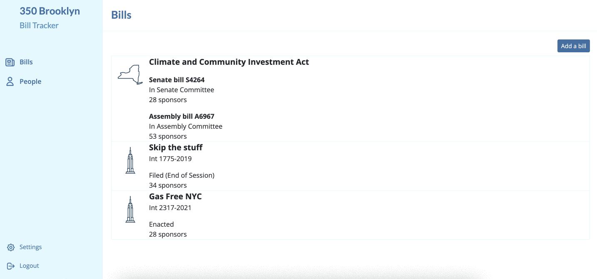

# 350 Bill Tracker

## Overview
The 350 Bill Tracker is a web app made for 350.org's Brooklyn chapter to help them lobby for strong climate legislation in NYC and New York State. It's a centralized place for volunteers to keep track of the bills that the group is pushing
and organize efforts to get them passed. Its use is locked down to organizers within the group, but some demos are displayed below.

Key features:
- Easily look up a bill from the NYC or NY State legislative data and start tracking it
- Keep a profile on city and state representatives, with contact info, notes, and key staffers
- Track the sponsorships and status of each bill, and automatically sync updates when these change
- Send email notifications when bill status and sponsorships change
- Automatically generate spreadsheets for the weekly "power hour" meeting, in which volunteers call city council members to urge them to pass specific bills

The main design principle is to keep it simple, and build only features that are useful and don't exist elsewhere. The city and state both already have websites displaying legislative info, and there's no point in recreating those. Along the same lines, a lot of activists work using simple tools like Google Sheets. We don't want to force too much of their workflow into this app instead, which has specific use cases in mind and requires software work to change.

Instead, this tool provides specific time-saving features by pulling in information that's helpful to have tracked in one place. It isgs
 meant to work alongside 3rd party websites and spreadsheets, rather than replace them.


## Tech stack
Backend:
- Python and Flask for the live server, exposing REST APIs
- Marshmallow for serialization
- Postgres and SQLAlchemy for storage
- Integrates with the NY City Council and NY State Senate APIs to import information on bills and representatives
- A cron job runs hourly to fetch the latest status of bills from those APIs. It sends out email notifications if there are any changes.
- Some contact information comes from the government APIs directly, and others are populated from static data (such as Twitter accounts)
- All main APIs and cron job logic have tests

Frontend:
- React and Typescript via Create React App
- Styling is a messy mixture of React Bootstrap and handcrafted HTML/SASS
- UX design by a software engineer whose only qualification is a few hours of Youtube videos 😱

Deployment:
- Hosted on Amazon Elastic Beanstalk
- The server and the cron job run on the same machine via Docker Compose
- The frontend gets built and served from the Flask server directly, since this is simple and the traffic on this will be very low (rather than serving them as static assets)
- Postgres uses RDS
- Email notifications via SES
- No CI. I just run tests and deployment myself from my machine

## Development

### Running locally

From repo root:
```bash
script/run
```

This builds the frontend and then hosts that inside the Flask app, which it starts in a Dockerized environment. Then you can
just hit `http://localhost` to run the frontend.

For local frontend development, you'll want a React dev server instead:
```bash
cd frontend
yarn start
```

This will point to the locally running Flask backend. You can have both running at the same time; just remember that port 3000 is the live frontend dev server whereas port 80 is the React app built into the Flask backend.

### Deploying

From repo root:
```bash
script/deploy
```

Do NOT just run `eb deploy` within the `backend` directory, as this will not rebuild the frontend to the latest version.

### Formatting
From repo root, autoformat both backend and frontend code:
```bash
script/format
```


# Demos
## Tracking a new state bill
 

## Generating a power hour spreadsheet
Each week, 350 Brooklyn runs phone bank sessions in which volunteers call the city
council members for particular bills to ask them to sponsor the bill. We run these
off a spreadsheet where volunteers log the results of each conversation. This tool
autogenerates the sheets along with the latest sponsorship status and contact info.
